# Hi, I'm Rohullah Saberi

**Software Engineer · Product Manager · Aria Soft Co-founder**

<a href="https://rohullah.ariasoft.co/">
  <picture>
    <source media="(prefers-color-scheme: dark)" srcset="assets/intro-dark.svg">
    <source media="(prefers-color-scheme: light)" srcset="assets/intro-light.svg">
    
  </picture>
</a>

I build web and desktop applications with **C#, ASP.NET Core, and WPF**. Since 2022, I've worked on software for education, finance, and healthcare, from examination workflows to administrative and reporting systems.

I'm a co-founder of [Aria Soft](https://ariasoft.co/) and a **Software Engineer & Product Manager** at [Kabul Code Lab](https://kabulcodelab.net/). My work combines application development, stakeholder discussions, and coordination of development tasks within a five-member team.

[Explore my portfolio →](https://rohullah.ariasoft.co/)

## What I work with

<picture>
  <source media="(prefers-color-scheme: dark)" srcset="assets/workflow-dark.svg">
  <source media="(prefers-color-scheme: light)" srcset="assets/workflow-light.svg">
  
</picture>

| Area | Technologies |
| :--- | :--- |
| Web applications | C#, ASP.NET Core, MVC, Razor Pages, Blazor |
| Desktop applications | WPF, MVVM |
| Data and reporting | SQL Server, MySQL, Entity Framework Core, Dapper, FastReport |
| Collaboration and delivery | Git, GitHub, Docker, GitHub Actions |
| AI integration | OpenAI API, structured-data workflows, natural-language-to-SQL |

## Selected work

Expand a project to see its illustration, details, and case study.

<strong>Aria OMR</strong> — Examination software

<a href="https://rohullah.ariasoft.co/projects/aria-omr/">
  <picture>
    <source media="(prefers-color-scheme: dark)" srcset="assets/aria-omr-dark.svg">
    <source media="(prefers-color-scheme: light)" srcset="assets/aria-omr-light.svg">
    
  </picture>
</a>

Examination software for reading multiple-choice answer sheets, calculating results, and preparing reports. I built the application from the ground up at Aria Soft.

**C# · WPF · MVVM · Dapper · MySQL**

[Read the case study →](https://rohullah.ariasoft.co/projects/aria-omr/)

<strong>Educational Center Management System</strong> — Education administration

<a href="https://rohullah.ariasoft.co/projects/ecms/">
  <picture>
    <source media="(prefers-color-scheme: dark)" srcset="assets/ecms-dark.svg">
    <source media="(prefers-color-scheme: light)" srcset="assets/ecms-light.svg">
    
  </picture>
</a>

Desktop software for managing students, classes, finances, staff, and attendance across educational center branches. I developed ECMS from the ground up and supported its updates and troubleshooting.

**C# · WPF · MVVM · SQL Server**

[Read the case study →](https://rohullah.ariasoft.co/projects/ecms/)

<strong>Hospital Management System</strong> — Hospital administration

<a href="https://rohullah.ariasoft.co/projects/hospital-management/">
  <picture>
    <source media="(prefers-color-scheme: dark)" srcset="assets/hms-dark.svg">
    <source media="(prefers-color-scheme: light)" srcset="assets/hms-light.svg">
    
  </picture>
</a>

An ASP.NET Core application for hospital administration, employee records, and access control. At Kabul Code Lab, I contribute as a Software Engineer & Product Manager, turning operational needs into application features.

**C# · ASP.NET Core · MVC · EF Core · MySQL · Docker**

[Read the case study →](https://rohullah.ariasoft.co/projects/hospital-management/)

I also worked with the team on [Kabul Code Lab's website](https://rohullah.ariasoft.co/projects/kabul-code-lab/) and [Shams School's website](https://rohullah.ariasoft.co/projects/shams-school/), contributing architecture, engineering direction, task assignment, and collaboration through GitHub.

## A little more about me

- **Education:** Bachelor of Computer Science, Kabul University.
- **Achievement:** 2nd Place — ICPC South Asia Regionals, 2023.
- **Work I enjoy:** building practical applications, improving reporting workflows, and connecting product needs with engineering decisions.

## Find me online

[Portfolio](https://rohullah.ariasoft.co/) · [Public CV](https://rohullah.ariasoft.co/assets/rohullah-saberi-resume.pdf) · [Telegram](https://t.me/rohullahsaberi) · [Facebook](https://www.facebook.com/ROHULLAHSABERl)
